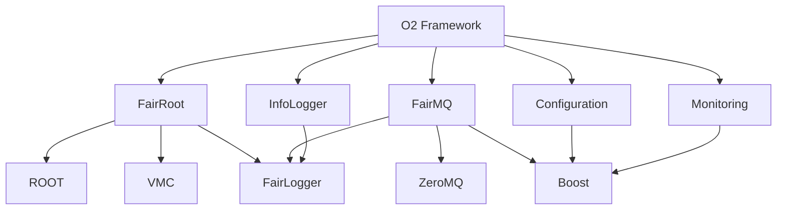

# O2フレームワーク パッケージ化ガイド

## 概要

このガイドでは、ALICE O2フレームワークをNixでパッケージ化する手順を説明します。O2フレームワークは複数の依存関係を持つ大規模なプロジェクトです。

## 依存関係マップ



## パッケージ実装戦略

### Phase 1: 基盤パッケージ

#### 1. Microsoft.GSL (Guidelines Support Library)
```nix
# Microsoft.GSLがNixpkgsにあるか確認
# 必要な場合のパッケージ定義例:
microsoft-gsl = pkgs.stdenv.mkDerivation rec {
  pname = "microsoft-gsl";
  version = "4.1.0";

  src = pkgs.fetchFromGitHub {
    owner = "microsoft";
    repo = "GSL";
    rev = "v${version}";
    sha256 = "...";
  };

  nativeBuildInputs = [ pkgs.cmake ];

  cmakeFlags = [
    "-DGSL_TEST=OFF"
    "-DCMAKE_BUILD_TYPE=Release"
  ];
};
```

#### 2. FairLogger
```nix
fairlogger = pkgs.stdenv.mkDerivation rec {
  pname = "fairlogger";
  version = "1.11.1";

  src = pkgs.fetchFromGitHub {
    owner = "FairRootGroup";
    repo = "FairLogger";
    rev = "v${version}";
    sha256 = "...";
  };

  nativeBuildInputs = with pkgs; [
    cmake
    pkg-config
  ];

  buildInputs = with pkgs; [
    boost
    fmt
  ];

  cmakeFlags = [
    "-DCMAKE_BUILD_TYPE=Release"
    "-DBUILD_TESTING=OFF"
  ] ++ pkgs.lib.optionals pkgs.stdenv.isLinux [
    "-DCMAKE_LINKER=${pkgs.lld}/bin/ld.lld"
  ];
};
```

#### 3. VMC (Virtual Monte Carlo)
```nix
vmc = pkgs.stdenv.mkDerivation rec {
  pname = "vmc";
  version = "2.0";

  src = pkgs.fetchFromGitHub {
    owner = "vmc-project";
    repo = "vmc";
    rev = "v${version}";
    sha256 = "...";
  };

  nativeBuildInputs = with pkgs; [
    cmake
  ];

  buildInputs = with pkgs; [
    root
  ];

  cmakeFlags = [
    "-DCMAKE_BUILD_TYPE=Release"
    "-DCMAKE_INSTALL_PREFIX=${placeholder "out"}"
  ];
};
```

### Phase 2: コアフレームワーク

#### 4. FairRoot
```nix
fairroot = pkgs.stdenv.mkDerivation rec {
  pname = "fairroot";
  version = "18.8.0";

  src = pkgs.fetchFromGitHub {
    owner = "FairRootGroup";
    repo = "FairRoot";
    rev = "v${version}";
    sha256 = "...";
  };

  nativeBuildInputs = with pkgs; [
    cmake
    pkg-config
  ];

  buildInputs = with pkgs; [
    root
    boost
    vmc
    fairlogger
    geant3  # 必要に応じて
    geant4  # 必要に応じて
  ];

  cmakeFlags = [
    "-DCMAKE_BUILD_TYPE=Release"
    "-DBUILD_EXAMPLES=OFF"
    "-DBUILD_TESTING=OFF"
    "-DCMAKE_INSTALL_PREFIX=${placeholder "out"}"
  ] ++ pkgs.lib.optionals pkgs.stdenv.isLinux [
    "-DCMAKE_LINKER=${pkgs.lld}/bin/ld.lld"
  ];

  # ROOTとの統合のため
  setupHook = ''
    export FAIRROOTPATH=${placeholder "out"}
  '';
};
```

#### 5. FairMQ
```nix
fairmq = pkgs.stdenv.mkDerivation rec {
  pname = "fairmq";
  version = "1.8.4";

  src = pkgs.fetchFromGitHub {
    owner = "FairRootGroup";
    repo = "FairMQ";
    rev = "v${version}";
    sha256 = "...";
  };

  nativeBuildInputs = with pkgs; [
    cmake
    pkg-config
  ];

  buildInputs = with pkgs; [
    boost
    fairlogger
    zeromq
    msgpack-cxx
  ];

  cmakeFlags = [
    "-DCMAKE_BUILD_TYPE=Release"
    "-DBUILD_TESTING=OFF"
    "-DBUILD_EXAMPLES=OFF"
    "-DCMAKE_INSTALL_PREFIX=${placeholder "out"}"
  ] ++ pkgs.lib.optionals pkgs.stdenv.isLinux [
    "-DCMAKE_LINKER=${pkgs.lld}/bin/ld.lld"
  ];
};
```

### Phase 3: ALICE固有コンポーネント

#### 6. InfoLogger
```nix
infologger = pkgs.stdenv.mkDerivation rec {
  pname = "infologger";
  version = "2.8.0";

  src = pkgs.fetchFromGitHub {
    owner = "AliceO2Group";
    repo = "InfoLogger";
    rev = "v${version}";
    sha256 = "...";
  };

  nativeBuildInputs = with pkgs; [
    cmake
    pkg-config
  ];

  buildInputs = with pkgs; [
    boost
    curl
    libmysqlconnectorcpp  # MySQL connector
    fairlogger
  ];

  cmakeFlags = [
    "-DCMAKE_BUILD_TYPE=Release"
    "-DCMAKE_INSTALL_PREFIX=${placeholder "out"}"
  ];
};
```

#### 7. Configuration
```nix
configuration = pkgs.stdenv.mkDerivation rec {
  pname = "configuration";
  version = "2.7.0";

  src = pkgs.fetchFromGitHub {
    owner = "AliceO2Group";
    repo = "Configuration";
    rev = "v${version}";
    sha256 = "...";
  };

  nativeBuildInputs = with pkgs; [
    cmake
    pkg-config
  ];

  buildInputs = with pkgs; [
    boost
    curl
    infologger
  ];

  cmakeFlags = [
    "-DCMAKE_BUILD_TYPE=Release"
    "-DCMAKE_INSTALL_PREFIX=${placeholder "out"}"
  ];
};
```

#### 8. Monitoring
```nix
monitoring = pkgs.stdenv.mkDerivation rec {
  pname = "monitoring";
  version = "4.4.0";

  src = pkgs.fetchFromGitHub {
    owner = "AliceO2Group";
    repo = "Monitoring";
    rev = "v${version}";
    sha256 = "...";
  };

  nativeBuildInputs = with pkgs; [
    cmake
    pkg-config
  ];

  buildInputs = with pkgs; [
    boost
    curl
    infologger
  ];

  cmakeFlags = [
    "-DCMAKE_BUILD_TYPE=Release"
    "-DCMAKE_INSTALL_PREFIX=${placeholder "out"}"
  ];
};
```

## 実装手順

### 1. 段階的追加
```bash
# 各パッケージを順次追加
nix build .#fairlogger  # Phase 1から開始
nix build .#vmc
nix build .#fairroot    # Phase 2
nix build .#fairmq
nix build .#infologger  # Phase 3
```

### 2. O2フレームワークの更新
```nix
# O2パッケージのbuildInputsを更新
o2 = pkgs.stdenv.mkDerivation rec {
  # ...
  buildInputs = with pkgs; [
    # 既存の依存関係
    root
    boost
    arrow-cpp
    # 新しく追加
    fairroot
    fairmq
    infologger
    configuration
    monitoring
    microsoft-gsl
    vmc
  ];
};
```

### 3. 開発環境の更新
```nix
devShell = pkgs.mkShell {
  buildInputs = with pkgs; [
    # ...
    # O2フレームワークを有効化
    o2
  ];

  shellHook = ''
    # CMAKE_PREFIX_PATHにすべて追加
    export CMAKE_PREFIX_PATH="${fairroot}:${fairmq}:${infologger}:$CMAKE_PREFIX_PATH"
  '';
};
```

## トラブルシューティング

### 一般的な問題

#### 1. ハッシュミスマッチ
```bash
# エラーメッセージから正しいハッシュを取得
error: hash mismatch in fixed-output derivation
         got:    sha256-AbCdEfGh...
# flake.nixのsha256を更新
```

#### 2. 依存関係エラー
```bash
# パッケージが見つからない場合
Could NOT find FairRoot (missing: FairRoot_DIR)

# CMAKE_PREFIX_PATHを確認
export CMAKE_PREFIX_PATH="${fairroot}:$CMAKE_PREFIX_PATH"
```

#### 3. ビルドエラー
```bash
# ログを詳しく確認
nix log /nix/store/xxx-package.drv

# デバッグビルド
nix build .#package --keep-failed
```

### プラットフォーム固有の問題

#### macOS
- LLDは使用しない（デフォルトリンカーを使用）
- Apple Clangとの互換性を考慮

#### Linux
- LLDリンカーを積極的に使用
- 並列ビルドの最適化

## ベストプラクティス

### 1. バージョン管理
- 各パッケージのバージョンを明記
- 互換性のあるバージョンを選択

### 2. ビルドフラグ
- テストとサンプルはOFFに
- リリースビルドを使用
- 必要最小限の機能のみ有効化

### 3. 依存関係の最適化
- 循環依存を避ける
- 不要な依存関係を削除
- パッケージサイズの最小化

## 参考資料

- [FairRoot GitHub](https://github.com/FairRootGroup/FairRoot)
- [FairMQ GitHub](https://github.com/FairRootGroup/FairMQ)
- [ALICE O2 Group](https://github.com/AliceO2Group)
- [Nix Manual](https://nixos.org/manual/nix/)